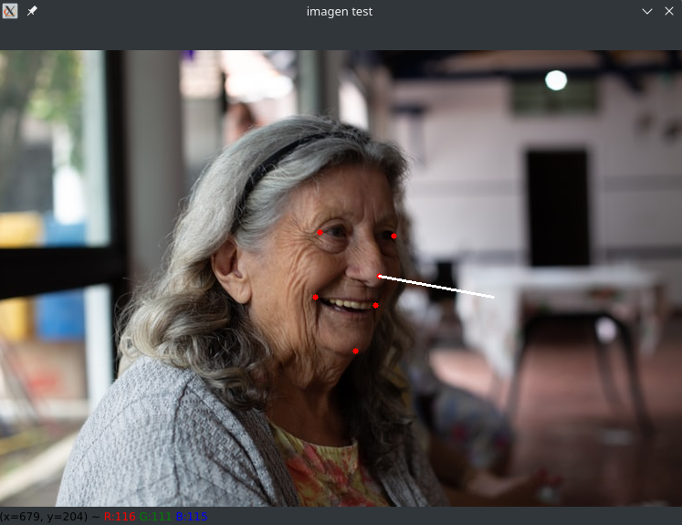

# Simple pose estimation

Mini example to understand basics of pose estimation with OpenCV.
Example based on the following [blog post](https://www.pythonpool.com/opencv-solvepnp/).

Image credits: Photo by Tatiana Zanon on Unsplash

Activate environment: `source ./env-pose-cv2/bin/activate`
Run script: `python headPoseCv2.py`

